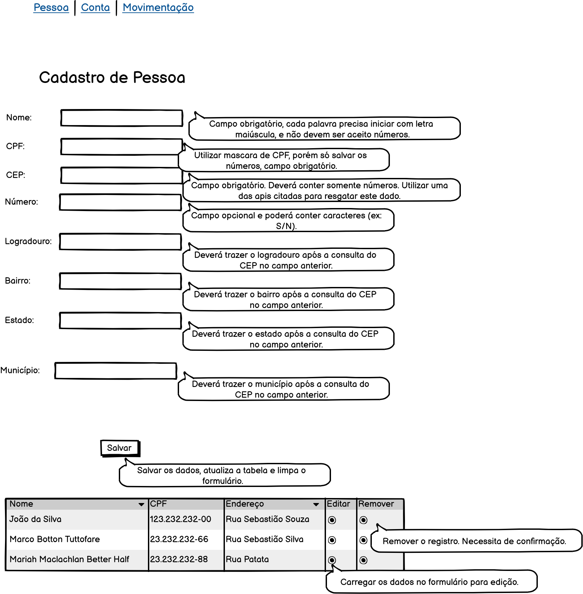

# Prova PHP IST

O desenvolvimento da prova consiste em desenvolver um sistema, conforme especificado nos protótipos abaixo.

**Cadastro de pessoa**

**Cadastro de conta**

**Cadastro de movimentação**

Para a realização da prova, deve-se utilizar a linguagem de programação **PHP** e o banco de dados **MySql**.

Alguns pontos em relação ao desenvolvimento: 
- Para realizar a consulta de CEPs proposta na tela de Pessoas, você poderá utilizar uma das apis abaixo:
    https://viacep.com.br/,
    https://apicep.com/api-de-consulta/
    ou outra de sua escolha.
- Você **DEVERÁ criar testes unitários** nas ações de salvar das entidades propostas nesta prova.
- Utilizar alguma biblioteca de desenvolvimento front-end como Bootstrap, Tailwind, Kickstart ou outra de sua escolha.
- Fique a vontade para adicionar bibliotecas e ferramentas externas, caso ache necessário.
- O arquivo de exemplo de conexão com o banco de dados, está no arquivo `app/index.php`.
- Organize os arquivos do projeto de uma forma adequada (MVC).

## Configuração do Projeto

O projeto utiliza docker para criar um ambiente de desenvolvimento necessário, utilizando **PHP** e **MySql**.

Necessário instalar o docker: https://www.docker.com/get-started

O banco de dados `ist` com a tabela `pessoas` deverá ser executado após subir o projeto, via terminal ou ide (DBeaver, DataGrip, ou alguma outra).
Mas cabe a você a estruturação e criação das demais tabelas, conforme modelado nos protótipos acima.
O script SQL de criação das demais tabelas necessárias para o projeto, deve ser adicionados no arquivo `db/ist.sql`.

Após o clone do projeto no **GitHub**, ir via terminal na pasta extraida e executar o comando do docker: `docker-compose up`.

**Atenção:** Se atentar que não pode haver nenhum serviço rodando nas portas `80` e `3306` no computador utilizado para a realização da prova, se tiver, será necessário fechar todos os serviços que utilizam essas portas.

Para verificar se a aplicação subiu corretamento com o docker, digitar no navegador http://localhost/, deverá mostrar uma tela inicial com **Hello World!**, caso tenha algum problema, verifica permissão de leitura / escrita do diretorio.
Para realizar conexão com Banco de dados você pode utilizar o software DBeaver - https://dbeaver.io/download/

Abaixo os dados para testar a conexão com o banco de dados:
- host: localhost
- port: 3306
- database: ist
- user: root
- password: 123.456

Algumas informações sobre nossos desenvolvimentos do dia a dia.
- Trabalhamos na sua maioria com banco postgres;
- Linguagens de PHP:
    - Symphony
    - Laravel
    - Laravel Livewire
    - Vue.js
    - Twig
    - Wordpress

No mais, desenvolva com qualidade e boa prova! :)
