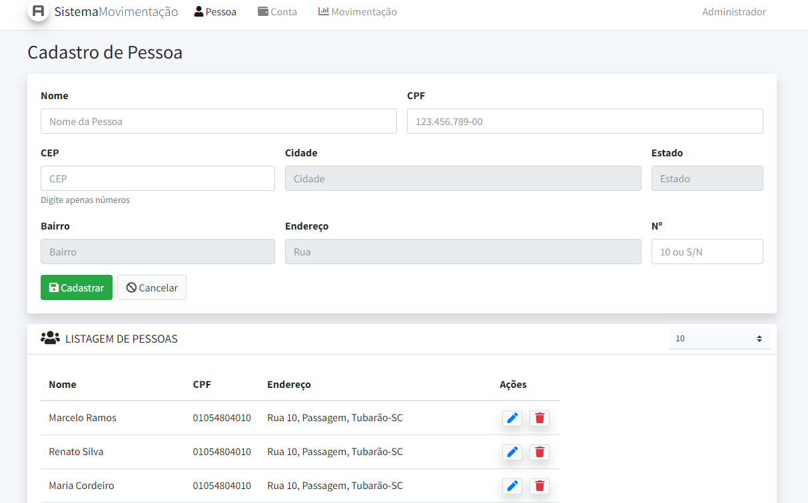
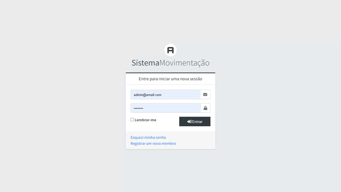
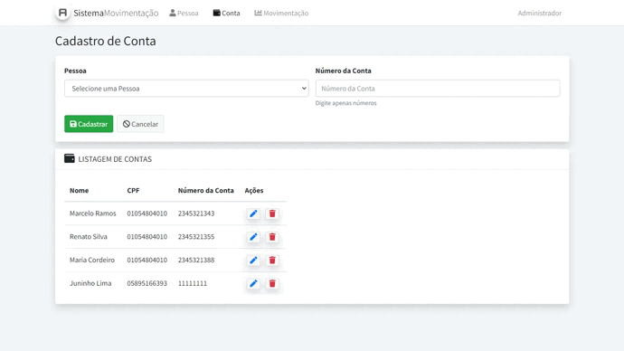
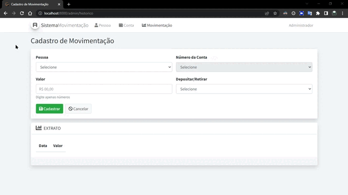

<p align="center" id="top">
    
</p>

<h1 align="center"> Sistema Movimentação de Conta com Laravel</h1>

<p align="center">
    <a href="#sobre">Sobre</a> • 
    <a href="#features">Features</a> • 
    <a href="#demo">Demo</a> • 
    <a href="#pre-requisitos">Pré-requisitos</a> • 
    <a href="#tecnologias">Tecnologias</a> • 
    <a href="#licenca">Lincença</a> • 
    <a href="#autor">Autor</a> 
</p>

### Sobre

Sistema Movimentação de Conta é uma aplicação web feito com o [Framework PHP Laravel](https://laravel.com/). Nessa aplicação foi realizado na prática os principais conceitos desse Framework que é um dos mais utilizado no mundo PHP.

### Caracteristicas principais

- [x] Cadastro, edição, exclusão e listagem de pessoa
- [x] Cadastro, edição, exclusão e listagem de conta
- [x] Cadastro e listagem de movimentações da conta
- [x] Consulta de CEPs proposta na tela de Pessoas, utilizado api: [https://viacep.com.br/](https://viacep.com.br/)

### Demo

<p align="center"><sub>Cadastro de pessoa</sub></p>

<p align="center">
    
</p>

<p align="center"><sub>Cadastro de conta</sub></p>

<p align="center">
    
</p>

<p align="center"><sub>Cadastro de movimentação</sub></p>

<p align="center">
    
</p>

<p align="right">
<sub>(Preview)</sub>
</p>

### Pre-requisitos

Antes de começar, você vai precisar ter instalado em sua máquina as seguintes ferramentas: [Git](https://git-scm.com/), [Composer](https://getcomposer.org/), [Framework PHP Laravel](https://laravel.com/) e [Docker](https://www.docker.com/). Além disto é bom ter um editor para trabalhar com o código como [VsCode](https://code.visualstudio.com/)

### 👨🏻‍💻 Rodando o Back End

#### 1. Clone este repositório

```bash
git clone https://github.com/SENAI-SD/01632-2022-037.278.793-27.git
```

#### 2. Acesse a pasta do projeto no terminal/cmd

```bash
cd 01632-2022-037.278.793-27
```

#### 3. Instale as dependências

```bash
composer install
```

#### 4. Fazer cópia <code>.env.example</code> para <code>.env</code>

```bash
cp .env.example .env
```

#### 5. Gerar nova chave

```bash
php artisan key:generate
```

#### 6. Configure suas variáveis ​​de banco de dados em <code>.env</code>

```bash
DB_CONNECTION=mysql
DB_HOST=mysql
DB_DATABASE=sistema_movimentacao_conta
DB_USERNAME=root
DB_PASSWORD=root
```

#### 7. Clone o Laradock dentro do projeto PHP

```bash
git clone https://github.com/Laradock/laradock.git
```

#### 8. Acesse a pasta do Laradock no terminal/cmd

```bash
cd laradock
```

#### 9. Fazer cópia <code>.env.example</code> para <code>.env</code>

```bash
cp .env.example .env
```

#### 10. Execute seus contêineres

```bash
docker-compose up -d nginx mysql phpmyadmin workspace
```

#### 11. Verifique os contêineres UP

```bash
docker-compose ps
```

#### 12. Abra seu navegador e acesse o <code>phpmyadmin</code>: <code>http://localhost:8081</code>

credenciais do <code>phpmyadmin</code>

```bash
server:mysql
user:root
pass:root
```

#### 13. Criar um novo esquema no Banco de Dados MySql: <code>sistema_movimentacao_conta</code>

#### 14. Executar comandos com bash interativo no Docker obs: Dentro do diretório <code>/laradock</code>  

```bash
docker-compose exec --user=laradock workspace bash
```

#### 15. Executar migrations e popular dados no Banco de Dados

```bash
php artisan migrate --seed
```

#### 16. Abra seu navegador e acesse localhost: <code>http://localhost</code>

### Tecnologias

As seguintes ferramentas 🛠 foram usadas na construção do projeto:

<table>
    <tr>
        <td><a href="https://www.php.net/">PHP</a></td>
        <td><a href="https://getcomposer.org/"> Composer</a></td>
        <td><a href="https://laravel.com/">Laravel</a></td>
        <td><a href="https://www.mysql.com/">MySql</a></td>
        <td><a href="https://getbootstrap.com/docs/4.0/getting-started/introduction/">Bootstrap 5</a></td>
        <td><a href="https://www.docker.com/">Docker</a></td>
    </tr>
    <tr>
        <td>7.4.*</td>
        <td>2.0.*</td>
        <td>8.*</td>
        <td>6.0.*</td>
        <td>5.0.*</td>
        <td>20.10.*</td>
    </tr>
</table>

### Referencias

- Instalar Laravel + Docker
  - Canal no Youtuber [Junior Araújo](https://youtu.be/4oO_ZGX3Rbs)
  - Canal no Youtuber [Carioca Code](https://youtu.be/GienvDWdBmo)

### Autor

> Made with 💙 by JUNIOR LIMA 👋 [See my LinkedIn](https://www.linkedin.com/in/junior-lima-495108208/) • GitHub [@JuniorLima22](https://github.com/JuniorLima22)

<p align="center">
<sub><a href="#top" align="center">↑ voltar para o topo ↑</a></sub>
</p>